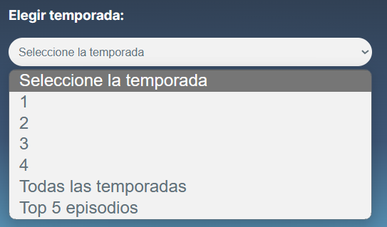
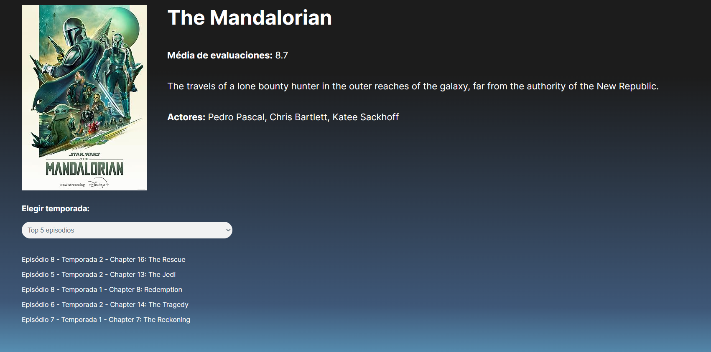

## Para saber más: errores de puertos
Al intentar ejecutar el proyecto, puedes obtener el siguiente error:
```java

***************************
APPLICATION FAILED TO START
***************************

Description:

Web server failed to start. Port 8080 was already in use.

Action:

Identify and stop the process that's listening on port 8080 or configure this application to listen on another port.

Process finished with exit code 1
```
Este error indica que estás intentando acceder al puerto 8080, pero ya está en uso. Spring Boot ya sube el servidor por defecto en el puerto 8080, pero podemos cambiar ese puerto para continuar sin errores. Para hacerlo, basta con agregar la siguiente línea en el archivo application.properties:
```properties
server.port=8081
```
En este caso, estamos cambiando el puerto a 8081, pero puedes intentar utilizar algún otro también. Así, tu proyecto se ejecutará normalmente y podremos continuar.
## Para saber más: conociendo HTTP, API REST y comunicación web
Al trabajar con Spring Web estamos levantando un servidor en un puerto de nuestra computadora. Pero, ¿qué es un servidor?

Servidor es justamente algo que ofrece recursos a los clientes. En nuestro caso, el recurso ofrecido serán las series que están en nuestra base de datos. Ofrecemos estos recursos con el uso de nuestra API, o "Interface de Programación de Aplicaciones", traduciendo la sigla.

Para que eso sea posible, necesitamos usar Spring Web como dependencia de nuestra aplicación. Con esto, a diferencia de como se hacía anteriormente, Spring inicia automáticamente un servidor TomCat en el puerto 8080, lo que facilita el trabajo del desarrollador.

Estamos desarrollando una API que se comunicará con el mundo externo a través del protocolo HTTP. Una vez que entendemos la relación entre servidor y cliente y conocemos HTTP, necesitamos pensar en cómo nuestros datos serán transmitidos.

Durante el curso, trabajaremos con una API REST (Representational State Transfer, o Transferencia de Estado Representacional). Cuando hablamos de este concepto, nos referimos a un conjunto de principios de arquitectura que especifican cómo las solicitudes y respuestas deben ser construidas en una API.

Los datos en una API REST son generalmente enviados y recibidos en el formato JSON (JavaScript Object Notation). No obstante, también pueden ser enviados en otros formatos, como XML.

La arquitectura REST sugiere el uso de métodos HTTP estandarizados para realizar tareas específicas, incluyendo:

- GET para obtener datos.
- POST para enviar nuevos datos.
- PUT para actualizar datos existentes.
- DELETE para eliminar datos.

Teniendo un estándar, la comunicación es mucho más eficiente. Además, las APIs REST deben ser stateless, lo que significa que las solicitudes del cliente pueden ser procesadas independientemente unas de otras. Esto las hace altamente escalables, facilitando la vida de los desarrolladores que trabajan en grandes proyectos web, ya que facilita la gestión, el mantenimiento y la prueba del software.

A lo largo del curso hablaremos más sobre todos estos conceptos y los veremos en la práctica. ¡Así, vamos a profundizar cada vez más! :D
## Para saber más: el patrón MVC
MVC es un concepto muy importante en el mundo de la programación. Esta es una sigla que significa Model-View-Controller, o Modelo-Vista-Controlador en español. Se utiliza para organizar el código de muchos tipos de software, facilitando el desarrollo y haciendo el programa más fácil de ser mantenido y actualizado. Vamos a entender mejor cómo todo esto funciona.

#### ¿Por qué el Modelo MVC es importante?
¡Imagina que estás construyendo una casa! Si simplemente comienzas a construir sin un plan, puedes terminar con habitaciones extrañas o estructuras mal posicionadas. Pero, si defines bien los proyectos antes de empezar, tu casa será mejor organizada y será más fácil de vivir. Lo mismo se aplica al código de un programa, donde la casa es equivalente a tu aplicativo y el plan es el modelo MVC.

Al seguir el modelo MVC, dividimos el código de nuestra aplicación en tres partes:

1 - El Modelo, que es donde todos los datos y las reglas de negocio son procesados.

2 - La Vista, que es la interfaz de usuario, donde ves los resultados de las operaciones.

3 - Y el Controlador, que es como el cerebro que opera las otras dos partes, recibiendo entradas del usuario y enviando comandos para el Modelo y la Vista.

#### ¿Cómo el Modelo, la Vista, y el Controlador interactúan?
Vamos a utilizar un simple ejemplo de un sitio web de registro de libros para explicar cómo funciona el modelo MVC.

En el caso del Modelo, piensa en él como el repositorio de todos los libros que están registrados en el sitio. Guarda toda la información, como título, autor y género del libro. También tiene todas las reglas, como verificar si el libro ya está registrado o no.

La Vista es la Página que ves en tu navegador. Presenta un formulario para agregar un nuevo libro y una lista de todos los libros ya registrados.

Y finalmente, tenemos el Controlador. Digamos que quieres agregar un nuevo libro. Escribes la información en el formulario y haces clic en 'Enviar'. Aquí es donde el Controlador entra en acción. Él “toma” la información que escribiste, verifica con el Modelo si el libro ya existe (si esa es la regla) y, si todo está correcto, pide al Modelo agregar el nuevo libro. Luego, instruye a la Vista para mostrar la nueva lista de libros con lo que acabas de agregar.

¿Ves cómo todo trabaja junto? Cada parte hace un trabajo específico, pero todas se comunican para mantener las cosas funcionando a la perfección.

¿Cómo el Modelo MVC ayuda en la organización del código y en el mantenimiento de la aplicación?

Cuando el código está bien organizado, es mucho más fácil identificar problemas, hacer actualizaciones y agregar nuevas funcionalidades. Por ejemplo, si un día decides que quieres cambiar el color de fondo de tu sitio, solo necesitas ir a la Vista y hacer el cambio. Si decides cambiar las reglas para agregar un nuevo libro, vas directo al Modelo.

Esta organización también facilita mucho la vida de cualquier otra persona que pueda trabajar en tu código en el futuro. Y si decides ofrecer tu sitio en diferentes idiomas, por ejemplo, puedes simplemente agregar una nueva Vista, sin necesidad de tocar el Modelo o el Controlador.

Entonces, el Modelo MVC es un gran aliado a la hora de desarrollar una aplicación. Además de facilitar el entendimiento y el mantenimiento del código, ayuda a prepararlo para los cambios y mejoras que siempre surgen con el tiempo.

#### MVC en Java
En Java, el patrón MVC era comúnmente aplicado utilizando las tecnologías JSP o Thymeleaf. Con JSP (Java Server Pages), es posible mezclar códigos Java y HTML para crear páginas web dinámicas. Con Thymeleaf, los códigos no se mezclan, pero tenemos páginas HTML dentro de la carpeta resources del proyecto. Estas páginas se comunican con el código Java y hacen que podamos visualizar la información en el navegador.

Estas tecnologías hacían que la Vista del MVC estuviera dentro de la aplicación Java. Sin embargo, actualmente lo más común en el mercado es tener una separación entre front-end y back-end. En el back-end, tenemos el Modelo y el Controlador. El back-end proporciona información que será utilizada por el front-end, que será responsable por la parte de la Vista.

Ahora que sabes la teoría, es hora de poner manos a la obra y empezar a practicar. Y recuerda: cada nuevo concepto aprendido es un paso adelante en tu trayectoria como desarrollador. ¡Buena suerte!

## Para saber más: estructuras de paquetes en proyectos Java
Durante nuestras clases, estamos utilizando una división de paquetes muy específica: para cada parte del proyecto, o capa, creamos un paquete diferente. Por eso trabajamos con controller, model, repository y otros paquetes. Este estilo de organización es llamado Package by Layer, o paquetes por capas.

Package by Layer es un enfoque que dice que debes dividir tu código basado en sus responsabilidades funcionales. Esto puede incluir cosas como 'model', 'view', 'controller' y 'repository'. Cada capa tiene una responsabilidad específica. Por ejemplo, la capa 'view' maneja la interfaz de usuario, mientras que la capa 'controller' se encargará de la lógica de negocio.

Vamos a considerar un ejemplo simple. Digamos que estamos construyendo una aplicación de blog. Con el enfoque 'Package by Layer', podríamos tener paquetes así:
```java
com.myblog
    .controller
        .PostController
        .CommentController
    .model
        .Post
        .Comment
    .repository
        .PostRepository
        .CommentRepository
```
En este ejemplo, todas las clases relacionadas con los posts del blog están esparcidas por diferentes paquetes, basados en la función que desempeñan. Lo mismo se aplica a las clases de comentarios.

Sin embargo, existe otro tipo de organización, utilizado, por ejemplo, en la formación de Spring Boot. Se llama Package by Feature, o paquetes por funcionalidades. Sugiere que debes organizar tu código basado en las características individuales de tu aplicación. En lugar de dividir tu código basado en su función, lo divides basado en la característica que implementa.

Usando el mismo ejemplo del blog, con 'Package by Feature', tendríamos algo así:
```java
com.myblog
    .post
        .Post
        .PostController
        .PostRepository
    .comment
        .Comment
        .CommentController
        .CommentRepository
```
En este ejemplo, todas las clases relacionadas con los posts están en el mismo paquete. Lo mismo se aplica a los comentarios. Cada paquete es autosuficiente y contiene todo lo que necesita para implementar una característica específica.

#### Cuándo usar cada uno
Entonces, ¿qué enfoque deberías usar? Depende. 'Package by Layer' puede ser útil si tienes un equipo grande y complejo, en el cual muchas personas pueden estar trabajando en diferentes capas al mismo tiempo. Separa las responsabilidades claramente, por lo tanto, es menos probable que las personas se pisen entre sí.

Sin embargo, 'Package by Feature' es a menudo preferido para proyectos más pequeños y ágiles. Mantiene todas las clases relacionadas con una característica juntas, lo que hace más fácil para un desarrollador entender completamente una característica. También es más fácil de mantener, porque cuando una característica es añadida o removida, sabes exactamente dónde están todas las clases relacionadas.

Aquí, optamos por utilizar Package by Layer, pero es interesante que analices todas las condiciones para ver la estructura que mejor se adapta a tu proyecto.

## Preparando el ambiente: código de la clase Cors Configuration
En el vídeo anterior, utilizamos la clase CorsConfiguration para manejar el error de CORS. Copia el código de la clase y úsalo en tu aplicación con nosotros.
```java
package com.aluracursos.screenmatch.config;

import org.springframework.context.annotation.Configuration;
import org.springframework.web.servlet.config.annotation.CorsRegistry;
import org.springframework.web.servlet.config.annotation.WebMvcConfigurer;

@Configuration
public class CorsConfiguration implements WebMvcConfigurer {
    @Override
    public void addCorsMappings(CorsRegistry registry) {
        registry.addMapping("/**")
                .allowedOrigins("http://127.0.0.1:5501")
                .allowedMethods("GET", "POST", "PUT", "DELETE", "OPTIONS", "HEAD", "TRACE", "CONNECT");
    }
}
```
## Para saber más: anotaciones de Spring Boot
Spring Framework ofrece una amplia gama de anotaciones para el desarrollo de aplicaciones web. Aquí están algunas de las anotaciones más comunes e importantes usadas en Spring para aplicaciones web:

- @Controller: Usada para marcar una clase como un controlador en el patrón MVC (Model-View-Controller). Esta anotación se utiliza para recibir peticiones y manejar lógica de negocios.
- @RestController: Una variante de @Controller, específica para APIs RESTful. Combina las anotaciones @Controller y @ResponseBody, señalando que cada método retorna un objeto serializado directamente en JSON o XML como respuesta.
- @RequestMapping: Define mapeos entre URLs y métodos de controlador. Especifica las URLs a las que un método del controlador debe responder y los métodos HTTP correspondientes (GET, POST, PUT, DELETE, etc.).
- @GetMapping, @PostMapping, @PutMapping, @DeleteMapping: Abreviaturas para las operaciones HTTP GET, POST, PUT y DELETE, respectivamente, en métodos de controlador.
- @RequestParam: Usada para mapear los parámetros de petición HTTP a los parámetros del método del controlador.
- @PathVariable: Usada para vincular variables de plantilla de URL a parámetros de métodos de controlador.
- @RequestBody: Utilizada para mapear el cuerpo de la petición HTTP a un objeto de entrada del método del controlador.
- @ResponseBody: Indica que el valor retornado por el método del controlador debe ser usado directamente como cuerpo de la respuesta HTTP.
- @Valid y @Validated: Utilizadas para activar la validación de entrada en el lado del servidor. Generalmente combinadas con anotaciones de validación, como @NotNull, @Size, @Min, @Max, entre otras.
- @CrossOrigin: Utilizada para configurar permisos de acceso a recursos de diferentes orígenes (CORS - Cross-Origin Resource Sharing).

Estas son algunas de las anotaciones más usadas en el desarrollo de aplicaciones web con Spring. La aplicación de estas puede variar dependiendo de las necesidades específicas de tu aplicación y de las versiones de Spring usadas.
## Preparando el ambiente: método específico para convertir de Serie para SerieDTO
En el video anterior, vimos que en dos métodos hubo la necesidad de recibir una lista de objetos del tipo Serie y transformarlos en una lista de objetos del tipo SerieDTO. Para estos casos, es siempre recomendable crear métodos específicos con el fin de evitar redundancia de código en la clase. De la misma forma, si hay necesidad de alteración, la misma podrá ser hecha en un único punto.

Mira abajo cómo quedó nuestro método para transformar esa lista:
```java
private List<SerieDTO> convierteDatos(List<Serie> serie){
        return serie.stream()
                .map(s -> new SerieDTO(s.getId(), s.getTitulo(), s.getTotalTemporadas(), s.getEvaluacion(), s.getPoster(),
                        s.getGenero(), s.getActores(), s.getSinopsis()))
                .collect(Collectors.toList());
    }
```
## Preparando el ambiente: código de la consulta JPQL
En el video anterior, filtramos los episodios de una serie por temporada y utilizamos una consulta JPQL. Para que tú también puedas utilizarla, copia el código anterior y adiciónalo en la clase SerieRepository, encima del método obtenerEpisodiosPorTemporada
```roomsql
@Query("SELECT e FROM Serie s JOIN s.episodios e WHERE s.id = :id AND e.temporada = :numeroTemporada")
```
El método completo, con query y firma, debe estar así:
```roomsql
@Query("SELECT e FROM Serie s JOIN s.episodios e WHERE s.id = :id AND e.temporada = :numeroTemporada")
    List<Episodio> obtenerTemporadasPorNumero(Long id, Long numeroTemporada);
    
```
## Manos a la obra: retornando los top episodios de una serie
Para ti que llegaste hasta aquí, tenemos un extra. Nuestro front-end recibió una modificación: en los detalles de la serie, además de exhibir todos los episodios de todas las temporadas y los episodios separados por cada temporada, también vamos a mostrar los top episodios de la serie. Puedes actualizar tu front haciendo un git checkout a la rama manos-en-la-masa y ejecutándolo. Se verá así:

Tu misión es configurar el endpoint "/series/id/temporadas/top". Hecho esto, al actualizar el front, aparecerán los top 5 episodios de la serie. En el ejemplo abajo están los top episodios de la serie "The Mandalorian":


## Lo que aprendimos
### En esta clase, aprendiste cómo:
- Trabajar de forma colaborativa. Vimos que es importante siempre probar exhaustivamente el código, más aún con registros diferentes. Solo así tenemos la confirmación de que nuestras búsquedas están correctas.
- Pasar parámetros en la url. Usamos nuevamente la anotación @PathVariable y vimos que puede ser utilizada tanto con números como con cadenas. Para que funcione, basta con que pasemos el nombre del parámetro entre llaves en la url del @GetMapping, exactamente como está declarado en la función.
- Comparar streams y búsquedas en la base de datos. Aprendimos que podemos utilizar tanto streams como consultas de la base de datos, no necesitamos restringirnos al uso exclusivo de uno de ellos. Basta con que analicemos la complejidad de las búsquedas, filtros y operaciones que haremos.
- Desarrollar una aplicación de forma incremental. Al trabajar en la integración del front con el back-end, identificamos, a lo largo del tiempo, los requisitos necesarios para que todo funcione en conjunto. El trabajo incremental es muy común en el ambiente de desarrollo.


